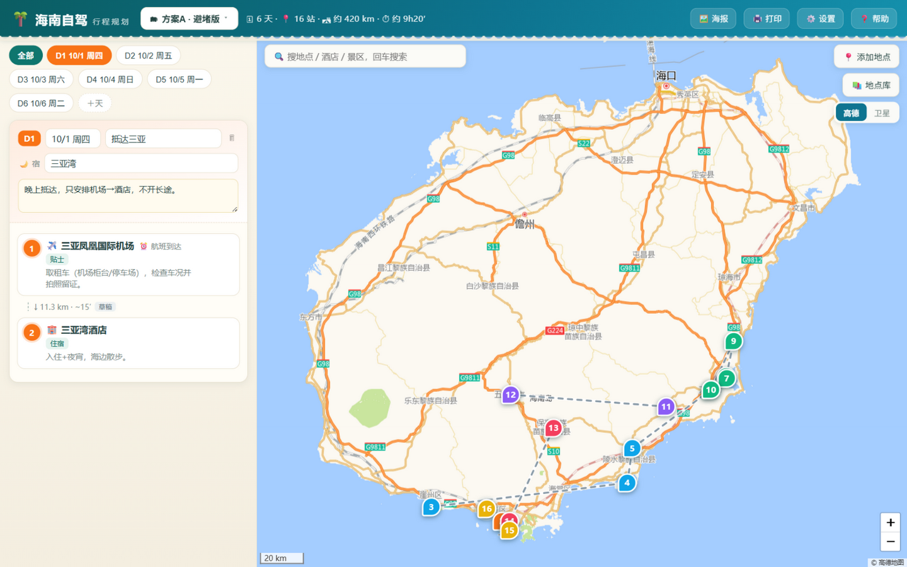
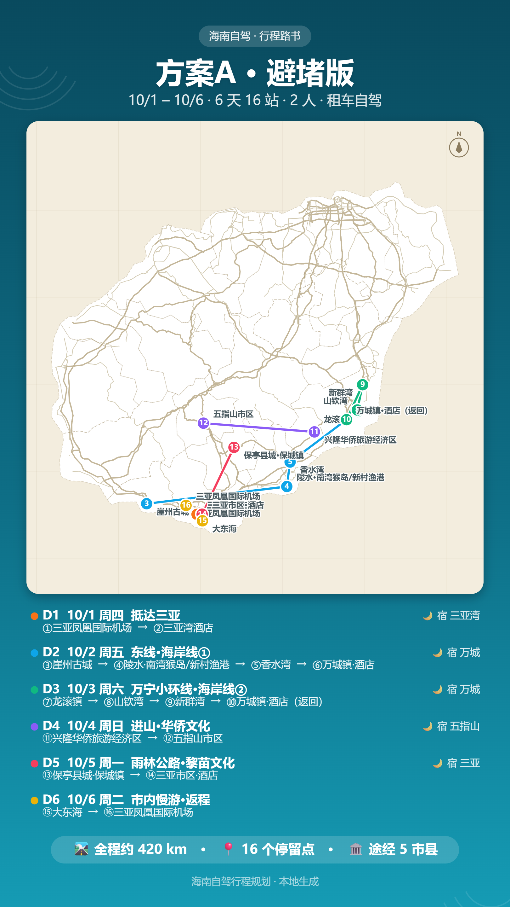
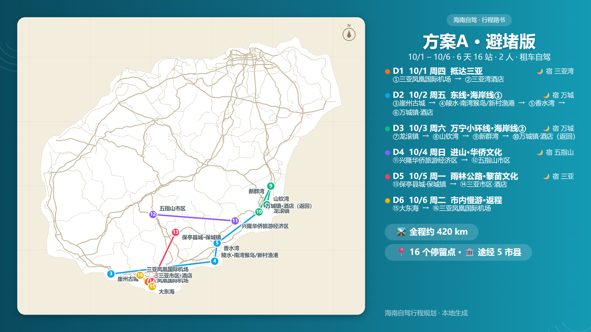

<div align="center">

# 海南自驾 · 行程规划

**一个单文件 HTML 的海南岛自驾「路书」工具 —— 双击即用，零安装、零依赖，数据全部保存在本机。**




*主界面：内嵌海南市县边界与骨干路网，左侧按天编排行程，右侧地图展示全部停留点。*

</div>

## 功能亮点

| 功能 | 说明 |
|---|---|
| 🗺️ 海南地图 | Leaflet + 内嵌市县边界数据，悬停高亮、点击查看该市县在方案中的途经情况 |
| 🛰️ 底图切换 | 高德标准（公路最全）/ 卫星影像，一键切换 |
| 🔍 地图搜索 | 输入酒店/景区/餐厅名精准定位（高德 POI），一键加为停留点或修正现有点位（需高德 Key，BYOK） |
| 📅 行程编排 | 按天组织；停留点拖拽排序（位置指示线、跨天拖放）；「⧉」复制到任意一天（含本天，环线日友好）；地图点选或从「地点库」（约 38 个精选地点 + 方案已有地点一键复用）添加 |
| 🛣️ 路线段 | 草稿直线估算 / 🖋️ 沿路手绘 / ⚡ 高德算路（真实距离与耗时） |
| 🏷️ 标签·笔记·图片 | 点位与路段均可挂分类标签、多行笔记、外部链接、图片（本地上传自动压缩存 IndexedDB） |
| ✨ 触发效果 | 路线流动虚线动画、当天聚焦、其余天淡化、悬停高亮 |
| 🗂 多方案管理 | 新建 / 复制 / 重命名 / 删除，localStorage 自动保存 |
| 🖼️ 分享海报 | 纯矢量 Canvas 绘制，竖版（朋友圈）/ 横版，高度随日程内容自适应，2x 高清 PNG 导出；站点名称标注可开关，地图范围支持全岛 / 按行程自适应缩放 |
| 🖨️ 打印 / PDF | 海报横版图 + 逐日行程明细表，走浏览器打印 |
| 💾 导出 / 导入 | JSON 文件备份与跨设备迁移（可选内嵌图片） |

**成品只有 `海南自驾规划.html` 一个文件**（约 510 KB，保留中文文件名方便直接分发），把 Leaflet、市县边界、骨干路网全部内嵌，不需要服务器、不需要安装任何东西。

## 界面与海报预览

| 竖版海报（朋友圈） | 横版海报 |
|---|---|
|  |  |

海报为纯矢量 Canvas 绘制（无底图瓦片、无照片），高度随日程内容自适应，断网也能生成。

## 快速开始

1. 下载仓库中的 **`海南自驾规划.html`**（页面上方文件列表直接点击下载）；
2. 双击用浏览器打开（Edge / Chrome 均可，手机浏览器也能用）；
3. 已内置默认方案「方案A · 避堵版」（6 天 16 站骨架），可直接修改或复制一份另编方案；
4. 工具内「❓ 帮助」有完整使用指南。

### 可选：接入高德 Key（BYOK）

不填 Key 也能使用全部其他功能（手绘路线用估算距离）；填了 Key 才能用 **地图搜索** 和 **⚡ 高德算路**。注册步骤约 5 分钟：

1. 打开 [lbs.amap.com](https://lbs.amap.com/)（高德开放平台），手机号注册或淘宝/支付宝登录；
2. 完成个人实名认证（免费，个人认证即可）；
3. 控制台 →「应用管理」→「创建新应用」→「添加 Key」，服务平台选 **「Web端(JS API)」**；
4. 将得到的 **Key** 和 **安全密钥（jscode）** 填入工具「⚙️ 设置」的两个输入框；
5. 点「测试连接」验证通过即可。

> **BYOK 说明**：Key 只保存在你本机浏览器的 localStorage 里，**不写入本 HTML 文件**——把文件分享给别人时，对方是空白状态，需自行注册填写。本工具与高德之间是浏览器直连，不经过任何中间服务器。

## 数据与隐私

- **不上传任何服务器**：方案数据存本机浏览器 localStorage；图片经前端压缩（长边 1600px / JPEG 82%）后存 IndexedDB。
- **导出备份**：重要节点建议用「🗂 方案 → 导出 JSON」做备份（可选是否内嵌图片）。
- **跨设备迁移**：旧设备「导出 JSON」→ 新设备「导入」即可，路线、笔记、图片一并带走。
- **file:// 存储隔离提醒**：个别浏览器对本地文件的存储按文件路径隔离，移动/重命名 HTML 文件后可能读不到旧数据——此时用备份 JSON 恢复即可；长期使用建议文件放定后不要再挪动。

## 从源码构建

```bash
python build.py
```

- 仅需 **Python 3** 标准库，无第三方依赖、无需 Node；
- 构建把 `src/` 源码与 `data/` 数据打包成单文件成品 `海南自驾规划.html`，**成品是唯一交付物**：改动 `src/` 后必须重新运行构建才能生效；
- `fetch_roads.py` 是构建期的**一次性**路网抽取工具（成品已内嵌结果，日常使用和构建都不需要它）。

### 目录结构

```
hainan-roadbook/
├── 海南自驾规划.html   ← 成品（双击运行，分发只发这一个文件，保留中文文件名）
├── build.py           ← 构建脚本（python build.py 重新生成成品）
├── fetch_roads.py     ← 从 OSM Overpass 抽取路网（构建期一次性使用）
├── src/               ← 源码（模板 / 样式 / util / store / mapview / panel / poster / main + 内嵌 Leaflet）
├── data/              ← 内嵌数据（市县边界 GeoJSON、简化骨干路网）
└── docs/              ← README 截图与海报预览图
```

### 技术要点

- **坐标系**：数据统一以 **WGS-84** 存储，渲染时按当前底图自动做 GCJ-02（火星坐标）加偏/去偏，路线与各底图道路对齐；高德算路结果已反向还原回 WGS-84。
- **纯矢量海报**：分享海报不使用底图瓦片与照片，全部 Canvas 矢量绘制，因此没有跨域限制，离线也能生成。
- **路网数据**：G98 环岛高速及主干公路取自 [OpenStreetMap](https://www.openstreetmap.org/)（Overpass API），经 Douglas-Peucker 抽稀后内嵌。
- **行政区划**：市县边界来自[阿里 DataV 开放数据](https://datav.aliyun.com/portal/school/atlas/area_selector)（已剔除三沙市对取景的干扰）。
- **Leaflet**：以源码形式内嵌（`src/leaflet.js` / `leaflet.css`），保证成品单文件离线可用。

## 常见问题

**断网了还能用吗？**
底图瓦片需要联网；断网时海岛轮廓（内嵌边界）、路线、站点、备注、海报生成均正常可用，仅高德 POI 搜索与算路不可用。

**手机上能用吗？**
把这个 HTML 文件发到手机（微信/AirDrop/网盘均可），用手机浏览器打开即可，显示与电脑一致、支持双指缩放。高德底图在移动网络下正常加载。

**怎么把数据换到新电脑 / 新手机？**
旧设备「导出 JSON」（可选内嵌图片）→ 新设备打开成品后「导入」。注意 `file://` 打开的页面存储按路径隔离，若导入后看不到数据，先确认文件位置固定再用备份恢复。

**为什么成品保留中文文件名？**
它就是给非开发者直接下载双击用的产品，中文文件名更友好；开发者克隆仓库后也可用 `python build.py` 随时重建。

## License

本项目以 [MIT License](LICENSE) 开源。数据来源：路网 © [OpenStreetMap](https://www.openstreetmap.org/copyright) 贡献者；行政区划来自阿里 DataV 开放数据；底图服务 © 高德地图。
